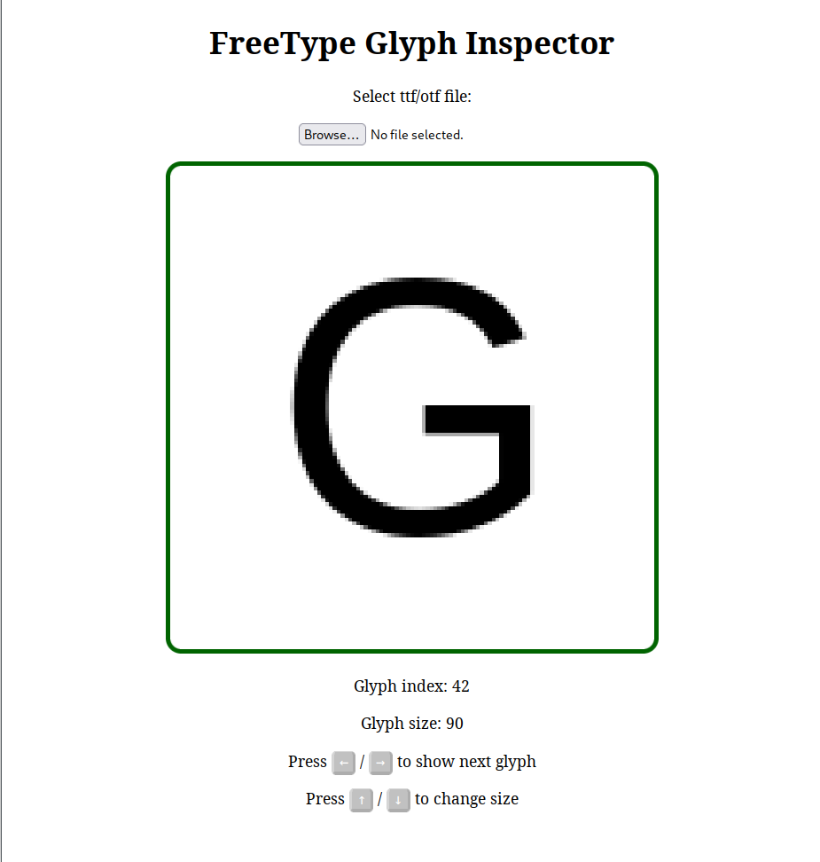

# FT-Wasm Glyph Viewer

Try it: https://anuthadev.github.io/ft-wasm/

Glyph Viewer that uses FreeType compiled to WebAssembly (without emscripten) for parsing and rendering of user-provided font files.

It can be used for viewing the glyphs present in a font, trying different rendering parameters in FreeType (WIP) etc.

# Building

FT-Wasm uses plain clang and LLVM for compilation. It does not use emscripten, but it does require a `WASI-libc` sysroot for compilation.

You can clone the `WASI-libc` repo from here : https://github.com/WebAssembly/wasi-libc.git

FT-Wasm expects the sysroot to be in `/tmp/wasi-libc`

`cd` into wasi-libc and enter:

    make install INSTALL_DIR=/tmp/wasi-libc

Next, make sure you have cloned the freetype submodule, then inside `ft-wasm` directory enter:

    ./build.sh

It should generate the output file `inspect.wasm` and a directory `objs/` containing compiled object files along with a static library `libfreetype.a` that you can use for linking other webassembly programs.
